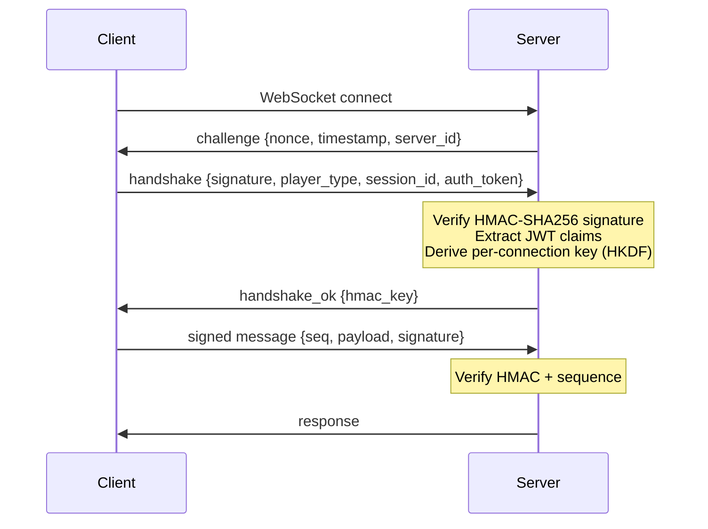

# workflow-plugin-ws-auth

WebSocket HMAC authentication plugin for the [workflow](https://github.com/GoCodeAlone/workflow) framework.

```
go get github.com/GoCodeAlone/workflow-plugin-ws-auth
```

## Features

- HMAC-SHA256 challenge-response handshake
- Per-connection key derivation via HKDF-SHA256
- Sequence-based replay protection
- JWT claim extraction (`player_type`, `sub`)
- Bidirectional connection <-> player mapping
- Constant-time signature comparison

## Auth Flow



## Configuration

Module type: `ws_auth.hmac`

```yaml
modules:
  my_auth:
    type: ws_auth.hmac
    config:
      shared_secret: "your-secret-key"
      server_id: "my-server"
```

The shared secret can also be set via the `SDK_SECRET` environment variable (takes precedence over config).

## Pipeline Step

Step type: `step.ws_auth_identity`

Extracts the player ID from an authenticated WebSocket connection.

```yaml
steps:
  - name: identify
    type: step.ws_auth_identity
    config:
      connection_id: "{{.connectionId}}"
```

Output:
- `player_id` -- the authenticated player's ID
- `authenticated` -- boolean indicating whether the connection is authenticated

## Build & Test

```sh
go build ./...
go test ./...
```

Requires Go 1.26+ and depends on:
- `github.com/GoCodeAlone/workflow` v0.3.52
- `golang.org/x/crypto` (HKDF)

## License

[MIT](LICENSE)
